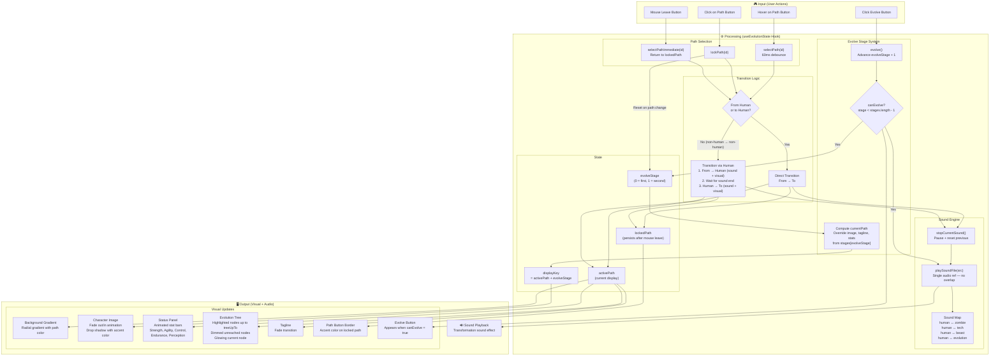
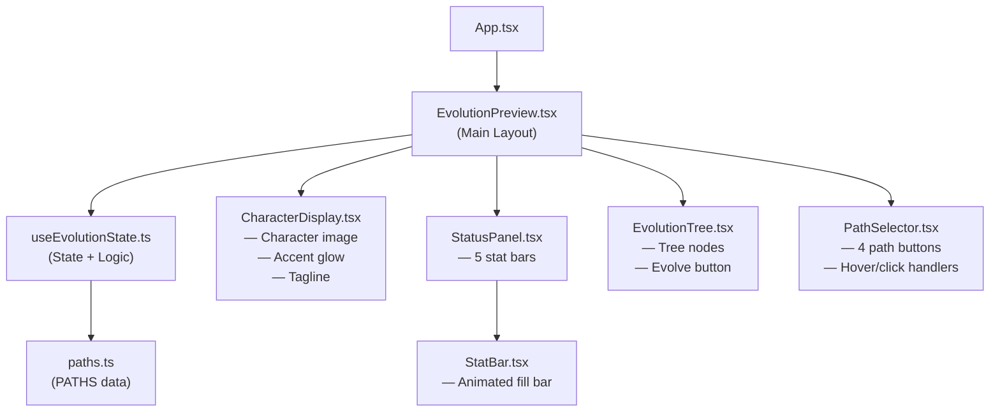
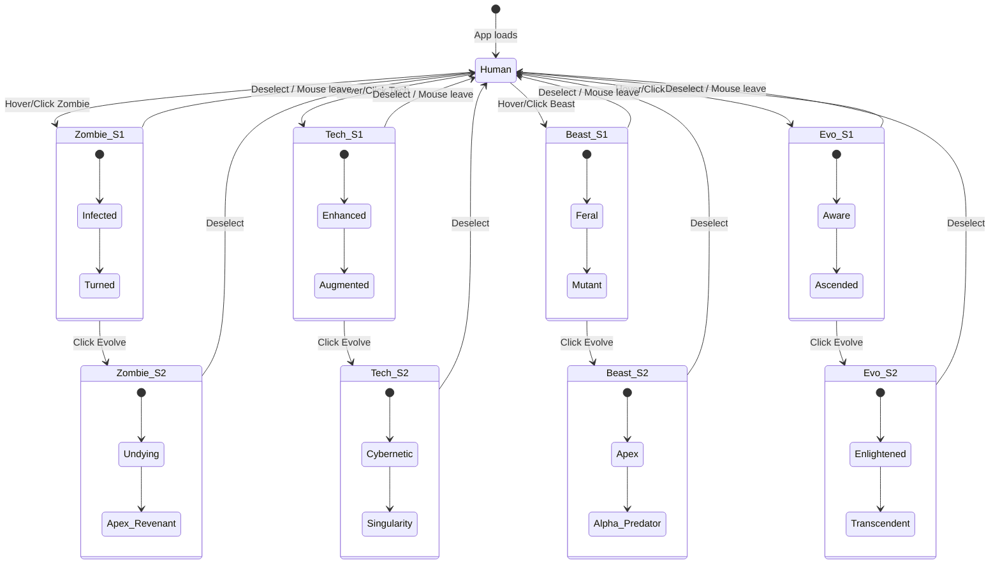
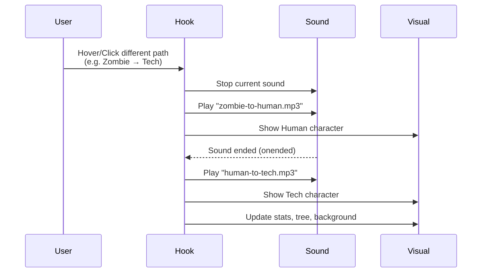

# System Flow — Evolution Preview

## Main Flow

```mermaid
flowchart TD
    subgraph Input["🎮 Input (User Actions)"]
        HOVER[Hover on Path Button]
        CLICK[Click on Path Button]
        LEAVE[Mouse Leave Button]
        EVOLVE_BTN[Click Evolve Button]
    end

    subgraph Processing["⚙️ Processing (useEvolutionState Hook)"]
        subgraph PathSelection["Path Selection"]
            SELECT_PATH["selectPath(id)\n60ms debounce"]
            LOCK_PATH["lockPath(id)"]
            SELECT_IMM["selectPathImmediate(id)\nReturn to lockedPath"]
        end

        subgraph TransitionLogic["Transition Logic"]
            CHECK{From Human\nor to Human?}
            DIRECT["Direct Transition\nFrom → To"]
            VIA_HUMAN["Transition via Human\n1. From → Human (sound + visual)\n2. Wait for sound end\n3. Human → To (sound + visual)"]
        end

        subgraph SoundEngine["Sound Engine"]
            STOP_SOUND["stopCurrentSound()\nPause + reset previous"]
            PLAY_SOUND["playSoundFile(src)\nSingle audio ref — no overlap"]
            SOUND_MAP["Sound Map\nhuman ↔ zombie\nhuman ↔ tech\nhuman ↔ beast\nhuman ↔ evolution"]
        end

        subgraph EvolveSystem["Evolve Stage System"]
            EVOLVE_FN["evolve()\nAdvance evolveStage + 1"]
            STAGE_CHECK{"canEvolve?\nstage < stages.length - 1"}
            COMPUTE["Compute currentPath\nOverride image, tagline, stats\nfrom stages[evolveStage]"]
        end

        subgraph State["State"]
            S_ACTIVE["activePath\n(current display)"]
            S_LOCKED["lockedPath\n(persists after mouse leave)"]
            S_STAGE["evolveStage\n(0 = first, 1 = second)"]
            S_KEY["displayKey\n= activePath + evolveStage"]
        end
    end

    subgraph Output["🖥️ Output (Visual + Audio)"]
        subgraph Visual["Visual Updates"]
            BG["Background Gradient\nRadial gradient with path color"]
            CHAR["Character Image\nFade out/in animation\nDrop shadow with accent color"]
            STATS["Status Panel\nAnimated stat bars\nStrength, Agility, Control,\nEndurance, Perception"]
            TREE["Evolution Tree\nHighlighted nodes up to treeUpTo\nDimmed unreached nodes\nGlowing current node"]
            TAG["Tagline\nFade transition"]
            BORDER["Path Button Border\nAccent color on locked path"]
            EVOLVE_UI["Evolve Button\nAppears when canEvolve = true"]
        end
        AUDIO["🔊 Sound Playback\nTransformation sound effect"]
    end

    HOVER --> SELECT_PATH
    CLICK --> LOCK_PATH
    LEAVE --> SELECT_IMM
    EVOLVE_BTN --> EVOLVE_FN

    SELECT_PATH --> CHECK
    LOCK_PATH --> CHECK
    SELECT_IMM --> CHECK

    CHECK -- "Yes" --> DIRECT
    CHECK -- "No (non-human → non-human)" --> VIA_HUMAN

    DIRECT --> STOP_SOUND --> PLAY_SOUND
    VIA_HUMAN --> STOP_SOUND

    PLAY_SOUND --> SOUND_MAP

    DIRECT --> S_ACTIVE
    DIRECT --> S_LOCKED
    VIA_HUMAN --> S_ACTIVE
    VIA_HUMAN --> S_LOCKED
    LOCK_PATH -- "Reset on path change" --> S_STAGE

    EVOLVE_FN --> STAGE_CHECK
    STAGE_CHECK -- "Yes" --> S_STAGE
    STAGE_CHECK -- "Yes" --> PLAY_SOUND
    S_STAGE --> COMPUTE
    COMPUTE --> S_KEY

    S_ACTIVE --> BG
    S_ACTIVE --> STATS
    S_ACTIVE --> TREE
    S_ACTIVE --> TAG
    S_KEY --> CHAR
    S_LOCKED --> BORDER
    STAGE_CHECK --> EVOLVE_UI
    PLAY_SOUND --> AUDIO
```

## Component Architecture

```mermaid
flowchart TD
    APP["App.tsx"]
    EP["EvolutionPreview.tsx\n(Main Layout)"]
    HOOK["useEvolutionState.ts\n(State + Logic)"]
    DATA["paths.ts\n(PATHS data)"]

    APP --> EP
    EP --> HOOK
    HOOK --> DATA

    EP --> CD["CharacterDisplay.tsx\n— Character image\n— Accent glow\n— Tagline"]
    EP --> SP["StatusPanel.tsx\n— 5 stat bars"]
    EP --> ET["EvolutionTree.tsx\n— Tree nodes\n— Evolve button"]
    EP --> PS["PathSelector.tsx\n— 4 path buttons\n— Hover/click handlers"]

    SP --> SB["StatBar.tsx\n— Animated fill bar"]
```

## Evolution Stage Flow

```mermaid
stateDiagram-v2
    [*] --> Human: App loads

    Human --> Zombie_S1: Hover/Click Zombie
    Human --> Tech_S1: Hover/Click Tech
    Human --> Beast_S1: Hover/Click Beast
    Human --> Evo_S1: Hover/Click Evolution

    Zombie_S1 --> Human: Deselect / Mouse leave
    Tech_S1 --> Human: Deselect / Mouse leave
    Beast_S1 --> Human: Deselect / Mouse leave
    Evo_S1 --> Human: Deselect / Mouse leave

    Zombie_S1 --> Zombie_S2: Click Evolve
    Tech_S1 --> Tech_S2: Click Evolve
    Beast_S1 --> Beast_S2: Click Evolve
    Evo_S1 --> Evo_S2: Click Evolve

    Zombie_S2 --> Human: Deselect
    Tech_S2 --> Human: Deselect
    Beast_S2 --> Human: Deselect
    Evo_S2 --> Human: Deselect

    state Zombie_S1 {
        [*] --> Infected
        Infected --> Turned
    }
    state Zombie_S2 {
        [*] --> Undying
        Undying --> Apex_Revenant
    }
    state Tech_S1 {
        [*] --> Enhanced
        Enhanced --> Augmented
    }
    state Tech_S2 {
        [*] --> Cybernetic
        Cybernetic --> Singularity
    }
    state Beast_S1 {
        [*] --> Feral
        Feral --> Mutant
    }
    state Beast_S2 {
        [*] --> Apex
        Apex --> Alpha_Predator
    }
    state Evo_S1 {
        [*] --> Aware
        Aware --> Ascended
    }
    state Evo_S2 {
        [*] --> Enlightened
        Enlightened --> Transcendent
    }
```

## Non-Human to Non-Human Transition

```mermaid
sequenceDiagram
    participant U as User
    participant H as Hook
    participant S as Sound
    participant V as Visual

    U->>H: Hover/Click different path<br/>(e.g. Zombie → Tech)
    H->>S: Stop current sound
    H->>S: Play "zombie-to-human.mp3"
    H->>V: Show Human character
    S-->>H: Sound ended (onended)
    H->>S: Play "human-to-tech.mp3"
    H->>V: Show Tech character
    H->>V: Update stats, tree, background
```
